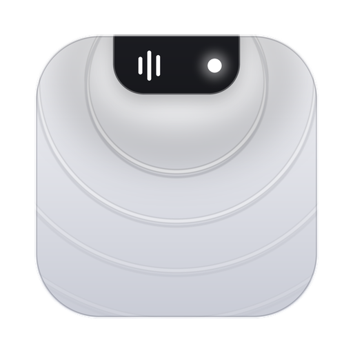

	

# Contributing to Notchly

Notchly is a personal project: a deliberately small, notch-only fork of [Atoll](https://github.com/Ebullioscopic/Atoll). Bug reports, ideas and pull requests are welcome, but I'm opinionated about scope, so please open an issue before starting anything big.

## What fits
- Anything that improves the notch experience: music, lyrics, live activities, HUDs, Stash, Quick Actions, the Hub.
- Fixes, performance and battery improvements, accessibility, and polish.

## What doesn't
- Features that were removed on purpose (terminal, clipboard history, system stats, notes, file shelf, widgets, extensions, calendar). Notchly is meant to stay small.

## Development setup
- macOS 14+ with Xcode 15+, and a MacBook with a notch for full testing.
- `open DynamicIsland.xcodeproj`, pick your own team under Signing & Capabilities, and run (⌘R).
- The Metal toolchain is needed for the visualizer shader: `xcodebuild -downloadComponent MetalToolchain`.
- Run the unit tests: `xcodebuild -scheme DynamicIsland -destination 'platform=macOS' CODE_SIGNING_ALLOWED=NO test -only-testing:DynamicIslandTests`.

## Pull requests
1. Fork, then branch from `notchly` (or `main` once it's merged there).
2. Keep changes focused. Put new logic in small, testable pieces and add unit tests where practical (the test target is not auto-synchronised, so add new test files to the Xcode project).
3. Keep the soft-glass monochrome look: use the tokens in `components/UI/NotchlyTheme.swift` and the springs in `NotchlyMotion.swift`, and respect Reduce Motion.
4. Keep content out of the hardware notch region (see `sizing/NotchWingLayout.swift`).
5. Make sure the build succeeds and the unit tests pass, and include screenshots or a recording for UI changes.

## Code of Conduct
Please be kind. See [CODE_OF_CONDUCT.md](CODE_OF_CONDUCT.md).

## License
By contributing you agree your work is licensed under GPL-3.0, like the rest of the project.
